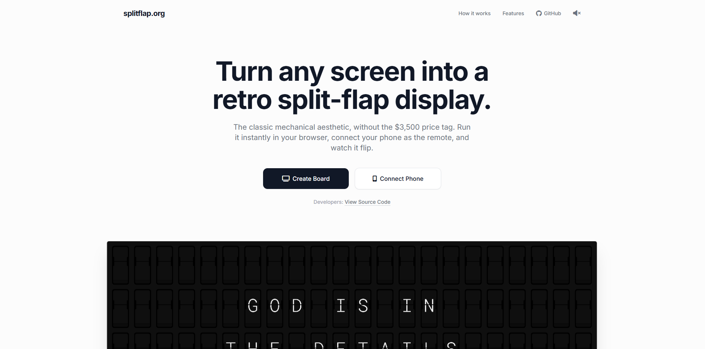
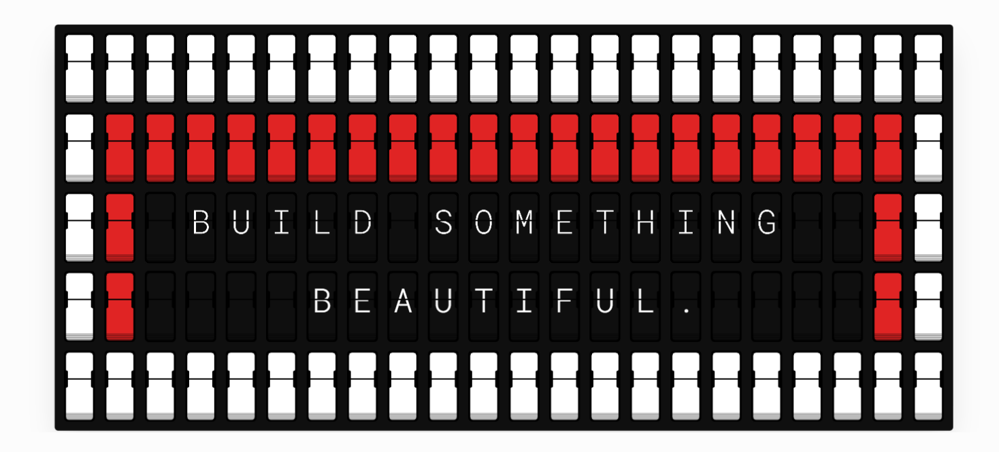

<div align="center">

# splitflap.org

**Open-source split-flap display for any screen. Pair your phone. Control it wirelessly.**

[](LICENSE)
[](https://nodejs.org)
[](#architecture)
[](https://github.com/MohdYahyaMahmodi/splitflap.org/pulls)
[](self-hosting.md)

<br />



<br />



<br />

[**Live Site**](https://splitflap.org) · [**Self-Hosting Guide**](self-hosting.md) · [**Report Bug**](https://github.com/MohdYahyaMahmodi/splitflap.org/issues)

</div>

---

## What is this

splitflap.org turns any screen into a retro mechanical split-flap display — the kind you'd see at train stations and airports. Open `board.html` on a TV or monitor, scan the QR code with your phone, and you have a fully controllable display with authentic animation and sound.

The entire system is four files: a Node.js server, a board display, a phone companion, and a standalone design tool. No build step, no frameworks, no external APIs.

## Features

### Display Engine

- **Sequential spool cycling** — each character module cycles through the alphabet in order (A→B→C→...→target), matching how real Solari boards work. No random scrambling.
- **Single rAF animation loop** — one `requestAnimationFrame` loop processes a sorted action queue instead of spawning thousands of `setTimeout` calls. A 22×5 board with full transitions generates ~3,000 scheduled actions processed by a single callback per frame.
- **Web Animations API** — flap rotation uses `element.animate()` on the compositor thread. No forced reflows from `offsetHeight` reads in hot loops.
- **CSS containment** — every cell has `contain: layout style paint` so DOM changes in one flap never trigger layout recalculation outside that cell.
- **GPU layer promotion** — falling flaps use `will-change: transform, opacity` for pre-promotion to compositor layers.
- **Web Audio API sound** — plays a real recorded `click.wav` with randomized pitch (±0.2) per flap. Falls back to a synthesized click (highpass + lowpass filtered noise burst, 35ms duration) if no audio file is present. Audio concurrency capped at 8 simultaneous nodes with 25ms minimum interval.

### Phone Companion

- **Message cards** — add multiple messages with the + button. Each card is an independent textarea. Messages loop automatically with configurable delay, or step through manually.
- **Mini board preview** — a grid matching your exact rows and columns shows real characters in each cell, color emoji cells in their actual color, and per-row counters (`R1: 15/22`) with overflow warnings.
- **Clock mode** — toggle from the companion to display live time (12h with seconds), day of week, month/date, and year, centered on the board and updating every second.
- **Full customization** — every visual parameter is adjustable in real time: flap width/height/split, bezel radius, pinch depth/height/slope, ridge count/height/gap/gradient, typography (family, size, weight, offsets), grid gap/padding/radius/shadow, top/bottom flap gradients, 7 color emojis (🟥🟧🟨🟩🟦🟪⬜), animation speed/stagger/easing/perspective.
- **Design Studio** — `custom-board.html` is a standalone tool with CSS export/import for designing flap aesthetics without a server.

### Security (3 layers)

1. **QR code with embedded secret** — the board generates a 32-character hex token (`crypto.randomBytes(16)`). The QR encodes `companion.html#BOARDID.secret`. Scanning auto-pairs instantly. The token is too long to read from across a room.
2. **Approval gate for manual codes** — if someone types the 6-digit code without the secret, the board shows a full-screen "Device wants to connect — Approve?" prompt. The person at the TV must press Enter/Space or click Approve. Escape or Reject denies access.
3. **Auto-lock after pairing** — once a companion connects, the board sets `locked: true`. All subsequent pair attempts are rejected. Pairing info disappears from the screen. The only way to unlock is disconnecting from the companion or kicking via the power button, which generates a new code and secret.

### Connection

- **Bidirectional auto-reconnect** — if the TV loses connection (browser crash, power loss), the server keeps the board record alive. The companion detects the disconnect and retries every 3 seconds. When the TV comes back, it reconnects with the same code and the companion re-syncs all settings and messages.
- **Smooth grid resize** — changing rows/columns from the companion fades the board out (250ms CSS opacity transition), rebuilds the DOM, then fades back in. No flash or jump.
- **WebSocket heartbeat** — server pings all connections every 30 seconds, terminates unresponsive ones.

## Architecture

```
splitflap.org/
  server.js              Express + WebSocket server
  public/
    index.html           Landing page with demo board
    board.html           TV display (connects via WebSocket)
    companion.html       Phone remote (pairs via QR or manual code)
    custom-board.html    Standalone design tool (no server needed)
    click.wav            Optional — recorded mechanical flap sound
```

### Server (`server.js`)

Express serves static files. A `ws` WebSocket server handles real-time communication. Each board is stored in a `Map` with:

```
boardId → {
  boardWs,        // WebSocket connection to TV
  companionWs,    // WebSocket connection to phone
  pendingWs,      // WebSocket waiting for approval
  secret,         // 32-char hex token for QR pairing
  settings,       // Last companion settings (persisted for reconnect)
  messages,       // Last message text (persisted for reconnect)
  mode,           // 'messages' | 'clock'
  locked,         // true when companion is connected
  lastActive      // Timestamp for TTL cleanup
}
```

Message types flow in two directions:

- **Companion → Server → Board**: `update_settings`, `update_messages`, `play_sequence`, `next_message`, `reset_board`, `set_mode`
- **Board → Server → Companion**: `board_state`, `companion_joined`, `companion_disconnected`
- **Pairing**: `register_board`, `pair`, `approve_pair`, `reject_pair`, `kick_companion`

### Board (`board.html`)

The board is a CSS grid of flap cells. Each cell consists of:

- Outer plate (`.rocker-switch`) with border radius
- Bezel layer with gradient
- Recessed hole with CSS `clip-path` polygon (calculated from pinch, slope, and corner arc parameters)
- Top half flap (static, shows current character top half)
- Bottom half flap (static, shows current character bottom half)
- Falling flap (animated via Web Animations API, rotates from 0° to -90° on X axis)
- Split overlay (the dark line between halves)
- Ridge elements at the bottom of each cell

The animation engine maintains a sorted array of `{time, fn}` objects. On each `requestAnimationFrame`, it processes all actions whose scheduled time has elapsed, then splices them from the array. When the queue is empty, the animation is complete.

### Companion (`companion.html`)

A mobile-optimized control panel built with vanilla HTML/CSS/JS. Communicates with the board exclusively through the WebSocket server — the companion and board never connect directly. All state changes are sent as JSON messages and applied on the board side.

The mini board preview parses the current message text, splits it into a grid matching the board's rows/columns, and renders each cell with the actual character or color. This runs on every keystroke via `requestAnimationFrame` debouncing.

## Quick Start

```bash
git clone https://github.com/MohdYahyaMahmodi/splitflap.org.git
cd splitflap.org
npm install
node server.js
```

Open `http://localhost:3000/board.html` on your TV.  
Open `http://localhost:3000/companion.html` on your phone.  
Scan the QR code. Done.

See **[self-hosting.md](self-hosting.md)** for production deployment with HTTPS, systemd, and reverse proxy.

## Dependencies

| Package              | Version | Purpose                                             |
| -------------------- | ------- | --------------------------------------------------- |
| `express`            | ^4.x    | HTTP server, static file serving                    |
| `ws`                 | ^8.x    | WebSocket server                                    |
| `helmet`             | ^7.x    | Security headers (XSS, HSTS, content-type sniffing) |
| `express-rate-limit` | ^7.x    | API endpoint rate limiting (100 req/15 min)         |

No frontend dependencies. No build tools. No transpilation.

## Browser Support

Tested on:

- Chrome/Edge 90+
- Safari 15+ (iOS and macOS)
- Firefox 90+
- Samsung Internet 15+
- Any Chromium-based Smart TV browser

Requires: CSS `clip-path: polygon()`, Web Animations API, Web Audio API, WebSocket.

## Configuration

### Environment Variables

| Variable | Default | Description |
| -------- | ------- | ----------- |
| `PORT`   | `3000`  | Server port |

### Board Constants (in `board.html` and `companion.html`)

The `S` object contains all visual parameters with sensible defaults. Every value is adjustable from the companion UI at runtime. Key defaults:

| Parameter      | Default | Description                         |
| -------------- | ------- | ----------------------------------- |
| `cols`         | 22      | Grid columns                        |
| `rows`         | 5       | Grid rows                           |
| `animDuration` | 360ms   | Final flip animation duration       |
| `fastSpeed`    | 25ms    | Intermediate spool cycling speed    |
| `animStagger`  | 40ms    | Wave delay between adjacent cells   |
| `msgDelay`     | 6000ms  | Pause between messages in loop mode |
| `scale`        | 0.22    | Flap cell scale factor              |

## Performance Notes

A 22×5 board (110 cells) with a full-board transition:

- **Animation queue**: ~3,000 scheduled actions (110 cells × ~27 avg spool steps × 3 actions each)
- **DOM operations**: Cached element references (`cellCache[]`) eliminate querySelector calls during animation
- **Audio**: Capped at 8 concurrent `AudioBufferSourceNode` instances with 25ms throttle
- **Layout**: CSS `contain` on each cell prevents global layout thrash. No `filter: drop-shadow` on animated elements (was removed — it was 220 GPU filter operations per frame)
- **Compositor**: Falling flaps run on the compositor thread via Web Animations API, no main-thread style recalculation during flip

## License

MIT — see [LICENSE](LICENSE)

## Author

**Mohd Mahmodi**  
[mohdmahmodi.com](https://mohdmahmodi.com) · [@MohdMahmodi](https://x.com/MohdMahmodi)
